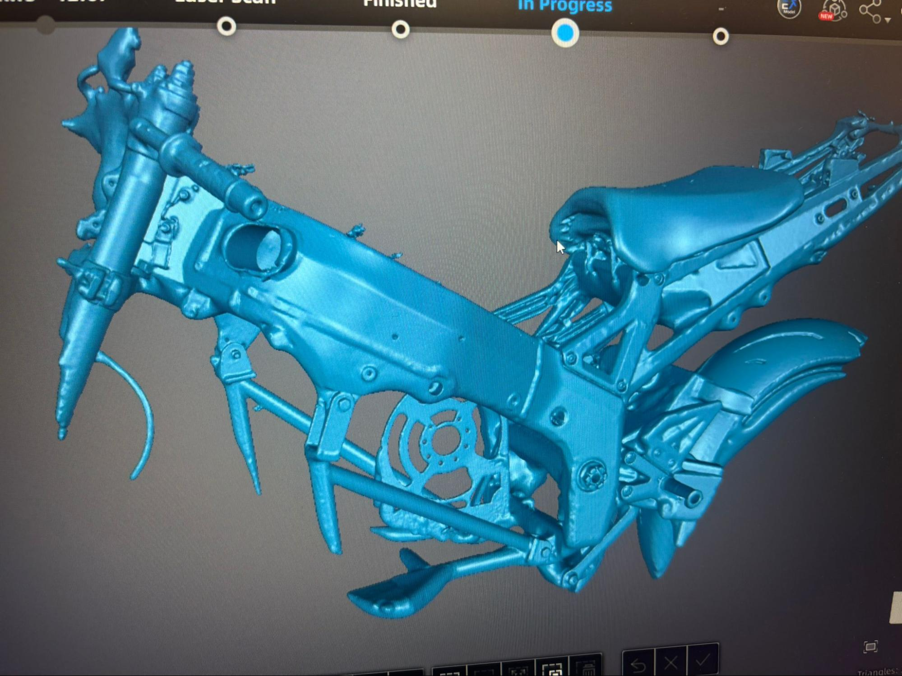

# 3D Scanning

This is a small project that I worked on with some of my other design team members.

We wanted to get an accurate 3D scan of the bike so that we could measure mounting holes virtually as well as ensure fitment of the battery pack and electronics. I had attempted before to model the frame in Solidworks but it was extremely time consuming, difficult, and hard to make accurate reference measurements due to the complex planes and geometry. Scanning seemed like an obvious next step.

The scanner that we used was an EinScan HX2.

We used these tracking dots as well as orange markers so the scanner could get accurate readings.

After doing numerous scans we ended up with a model we were happy with and moving forward I am going to be doing some post processing and triangle optimization to keep the file small so it doesn't crash Solidworks.

