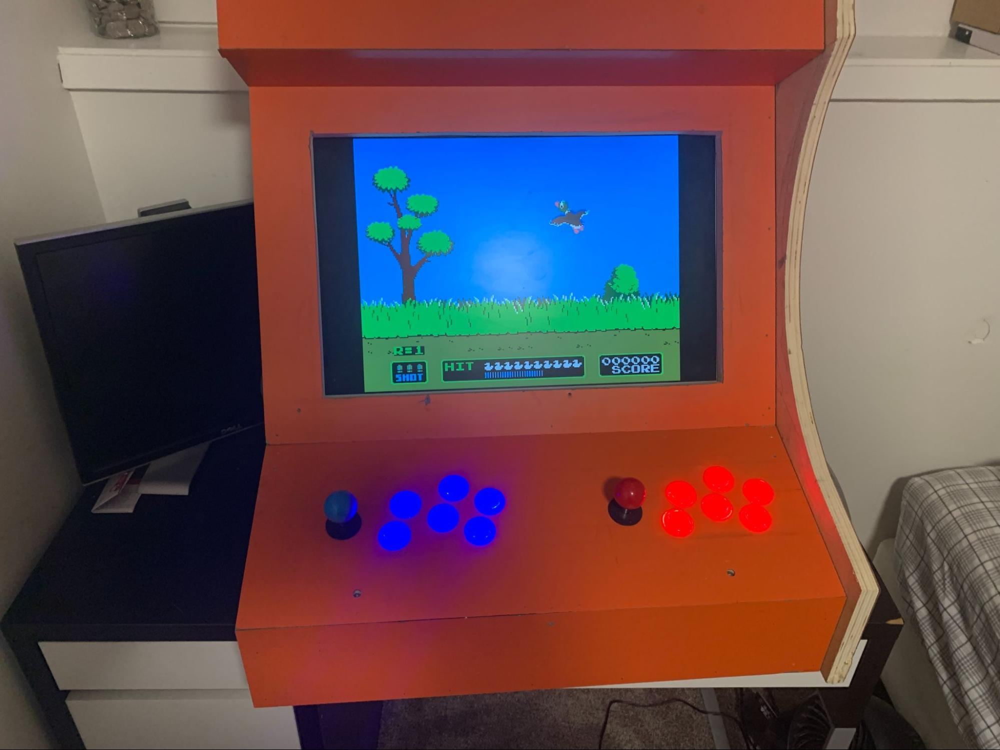
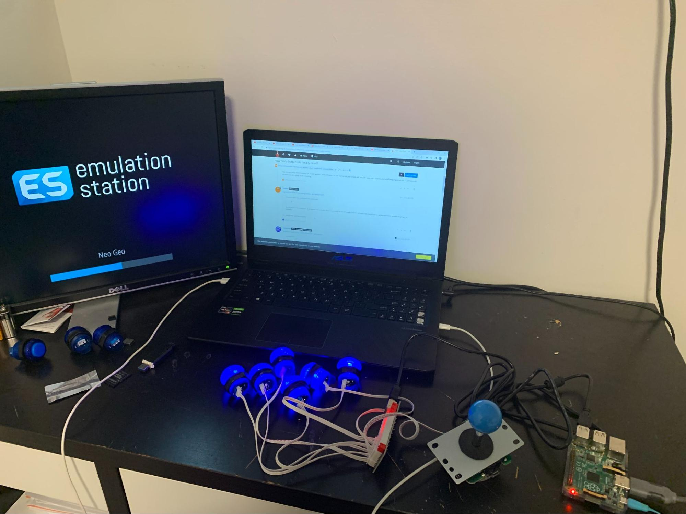
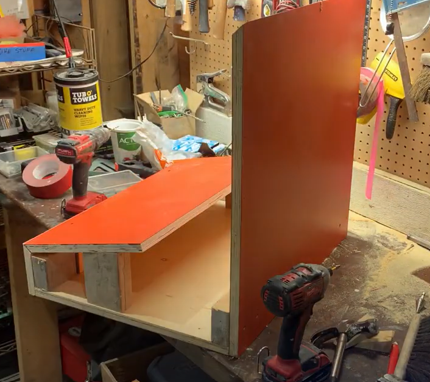
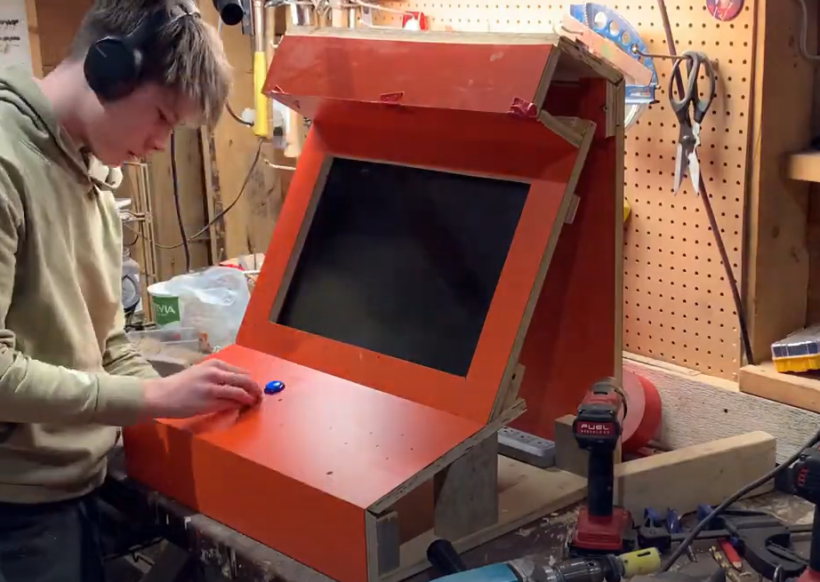
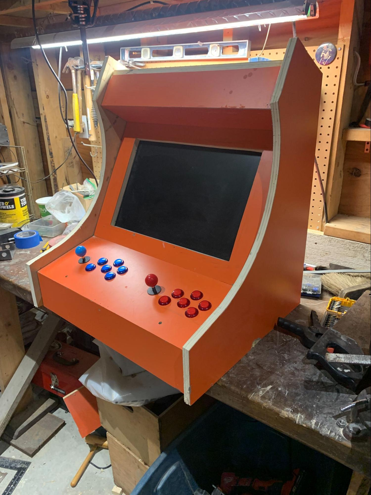

# Aracde Machine

This is an arcade machine that I built for my grade 12 capstone project. It was made using a raspberry pi and a set of buttons and joysticks. The design is custom and I made it using autodesk inventor.

Unfortunately I lost the CAD files but it was made using autodesk inventor and modeled the shape and construction of the machine.

After I designed the thing I tested out buttons and joysticks on an old monitor that I was going to use.

After the electronics were tested I started making the wooden casing. I referenced the CAD and made paper templates which were cut on a skill saw and jigsaw.

The entire thing was brad nailed together and used woodglue to keep the entire thing secured.

Once that was done I drilled out holes for buttons and strapped a monitor screen on.

Once it was finished I simply added the sides on and attached all of the electronics on the inside.

