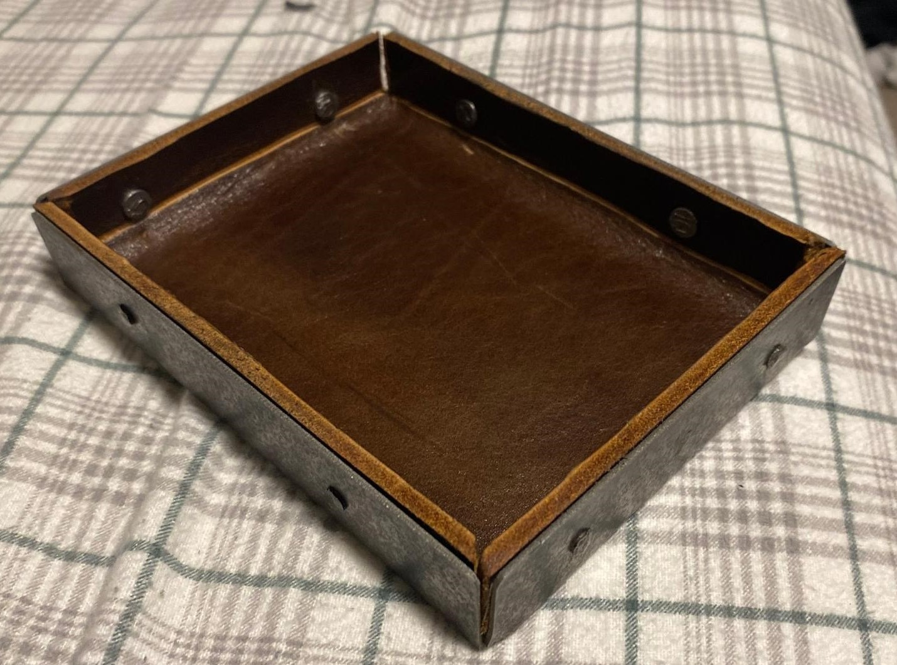
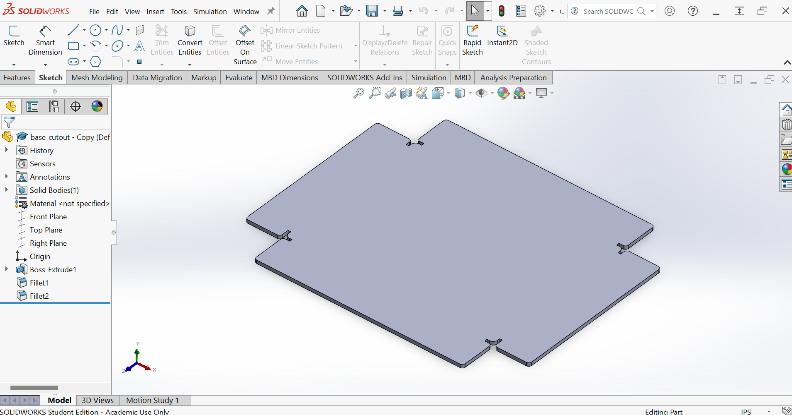
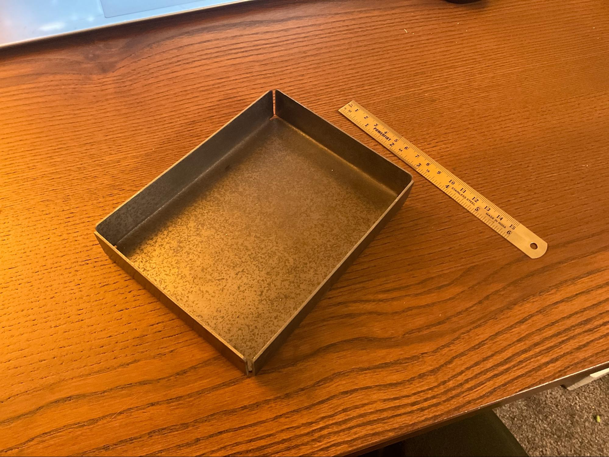
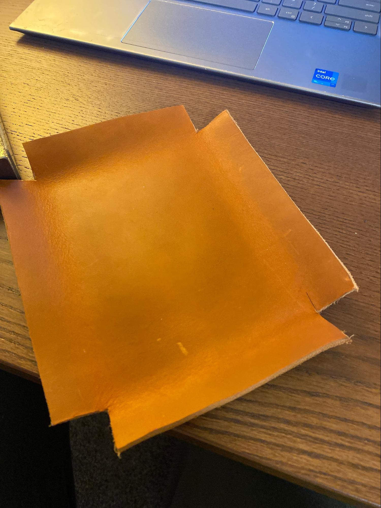
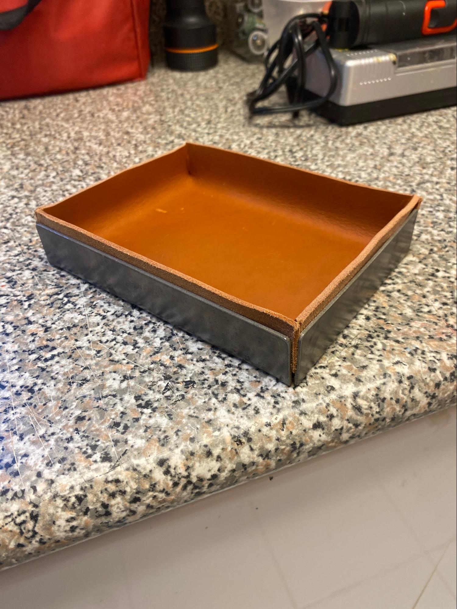
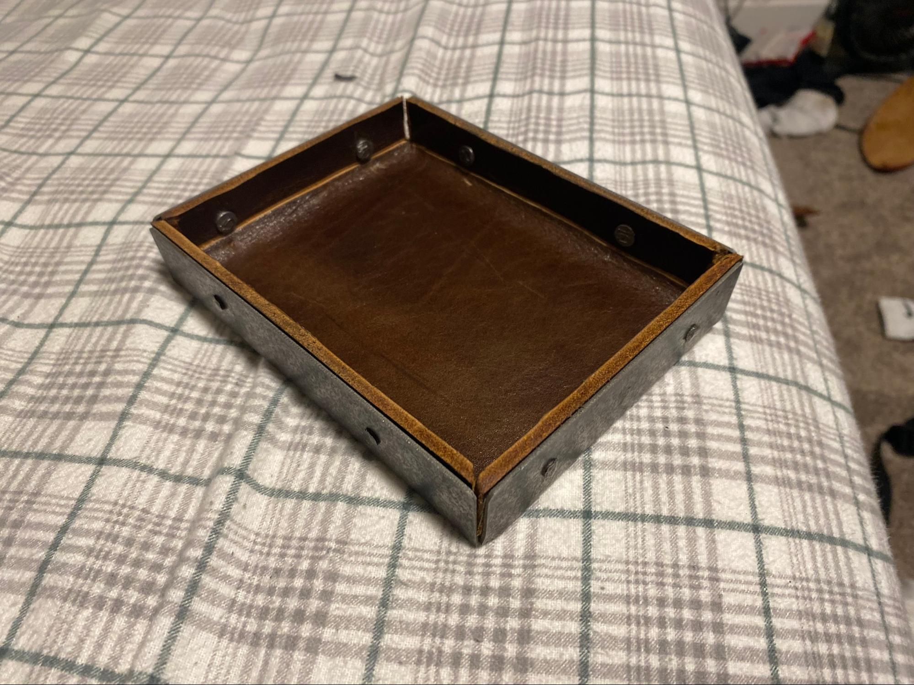

# Catchall

I needed somewhere to put my keys in my room so I decided to make my own. I wanted to utilize some of the scrap metal available to me as well as get a chance to use the metal bender and waterjet.  

Started by making a 2D design on SolidWorks and decided on making it 6 x 4.5 inches.  

Then I waterjet the metal and used the bending jig to create an open box.  

After this I printed a template and cut out a piece of leather that would be an inner liner of the metal. I used a simple box cutter and a ruler to get sharp lines on the leather which I used a little bit of leather rub to look nice on the edges.  

After this was done I just used a simple two part epoxy to adhere the leather to the steel ensuring that the metal was sanded to 120 grit so the epoxy would bond better.  

After this one I decided to make another version with a thicker darker leather for my grandpa. This one used a very similar design but instead of using epoxy I drilled a hole through the leather and metal and inserted a nail which was then peened over to create a rivet. I like the look of this design and it is a little more sturdy and refined looking than the first attempt.  

