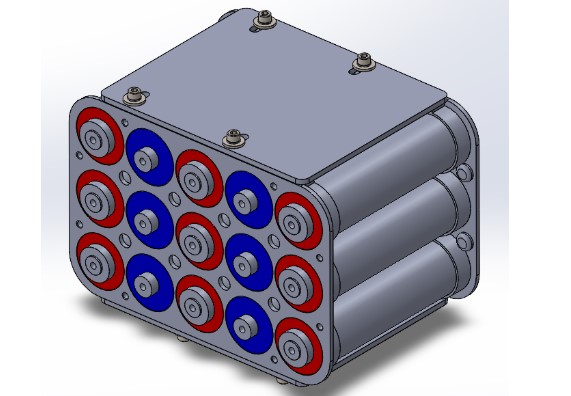
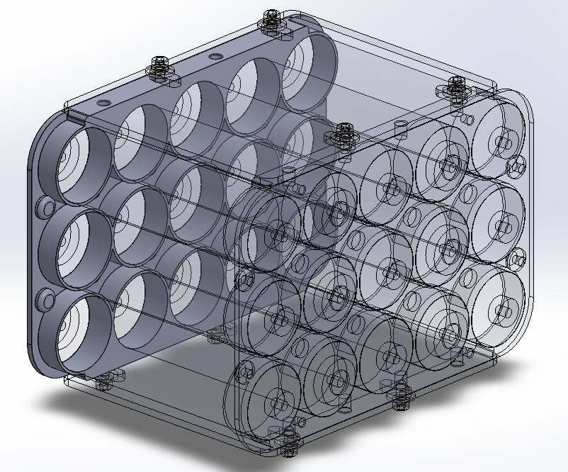
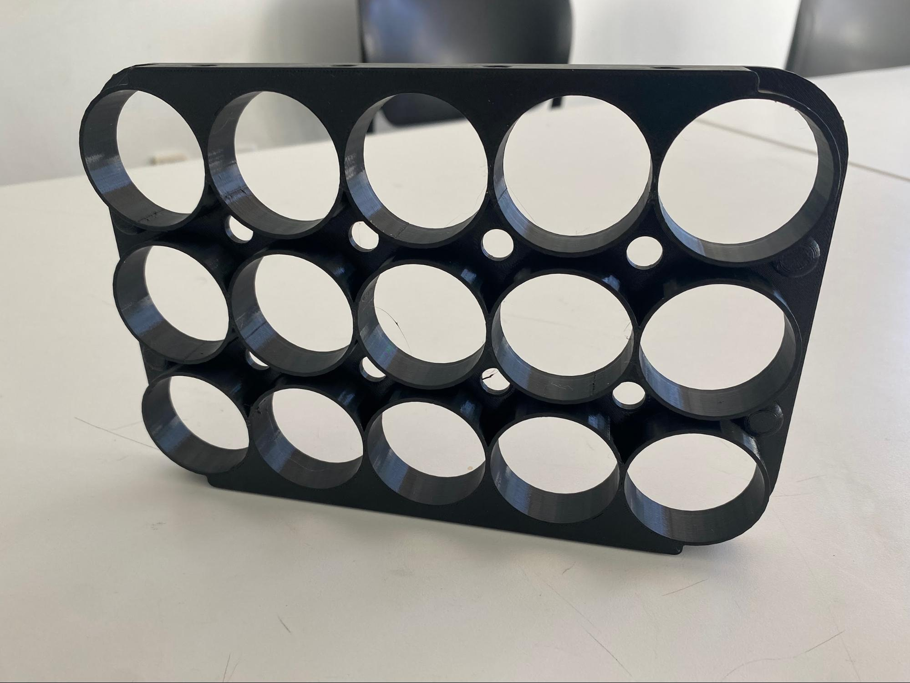
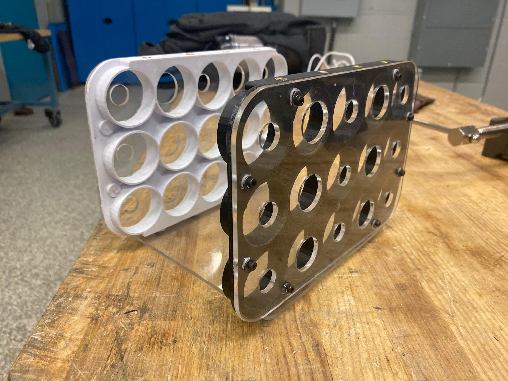

# Battery Cell Holders

This is a cell design used to house a collection of 5 x 3 cells of batteries. This project was made on an engineering design team where we are creating a fully electric racing bike. This design was constrained by needing a very tight packing efficiency while still allowing passive air cooling between the cells. The ends were also needed to remain open to allow cooling plates on either end.

The design started by designing these cell holders in CAD. They needed to be strong enough to keep the batteries from falling out while remaining lightweight and without huge print times. I landed on this design which combines rigidity with weight.

These were printed and I attached threaded inserts in holes in the top and sides

Then I created the sides and bottom portions which would keep the whole thing sturdy while keeping manufacturing times low due to laser cutting from vinyl sheets.

The acrylic is just a temporary proof of concept but moving forward I will be machining a stronger, more lightweight casing from acetal delrin.