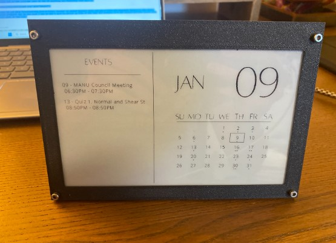
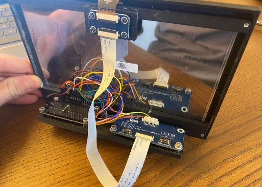
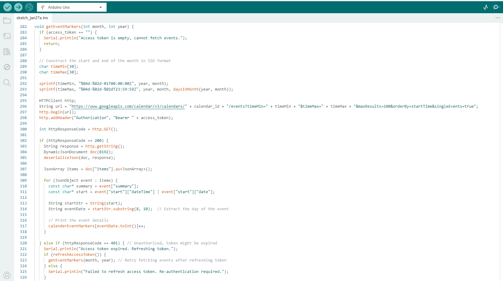

# E-Ink Digital Calendar

  

This is a low power desktop calendar which can display all of my google calendar events on a screen

I came up with this idea when I had a desk calendar but I found myself never using it because everything was online in my google calendar so I decided to make a desk calendar that would reflect what was happening virtually. The main goal for this project was to run off a battery, so I don't need any cables on my desk. This is a very difficult task with a regular screen but this uses an e-ink screen which only draws minimal power when refreshing but does not have any power consumption otherwise. In fact even if you completely remove power it will still display the last image it had.  

I sourced the following components for the build:  

- ESP32 - as the brains of the operation, this chip has wifi and bluetooth connectivity which makes it easy to connect to an api.  

- Waveshare 7.5 inch E-Paper display - low power e ink display which has no backlight and does not require power on standby

- Tp4056 - BMS (battery management system)
Lipo battery (from old digital camera)

With components sourced I used digital calipers to CAD all of the components individually and then designed a frame and mounting for all the parts. I then 3d printed the case and added all of the parts into the enclosure.

Now I moved onto the most challenging portion for me, the software. I used the arduino ide with an esp32 to code the entire thing. I used the google calendar api documentation to implement a system where the esp could get access to all of the calendar events for a given month. This was then formatted into a dictionary with each date corresponding to the event name. These could then be displayed onto the screen in a list view on the left with each name as well as a small dot on the calendar view to see if anything was happening that day

In the future I want to add more functionality like a rotary encoder to switch between views and add a clock and stopwatch feature to the clock. This is one of my favourite projects due to how much I use it and I want to polish up some of the code and hardware so I can release the open source code and 3D files so others can make it too.