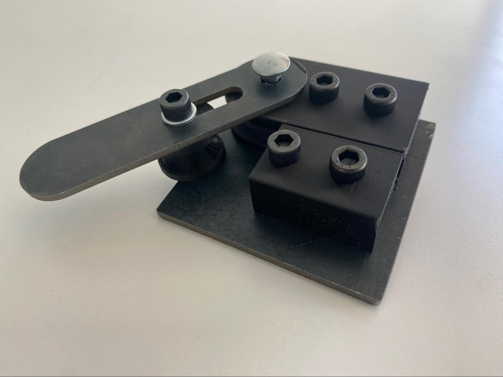
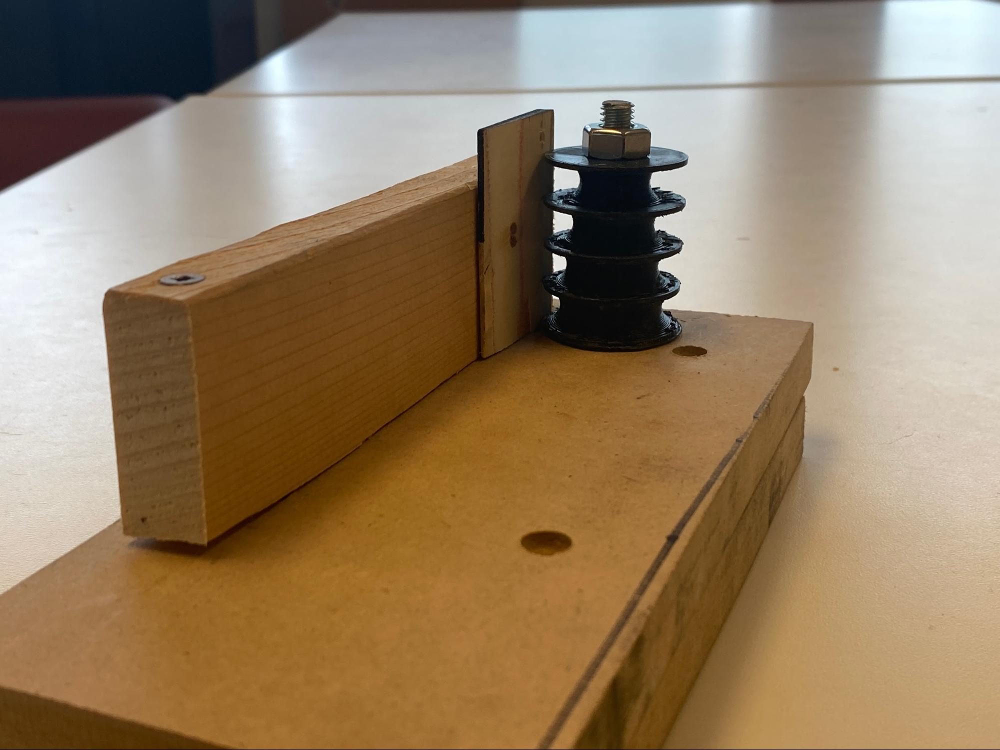
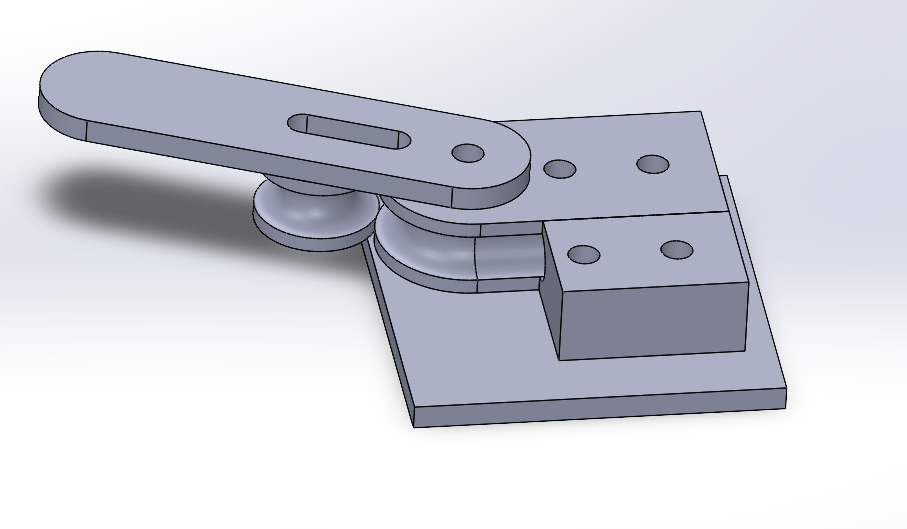
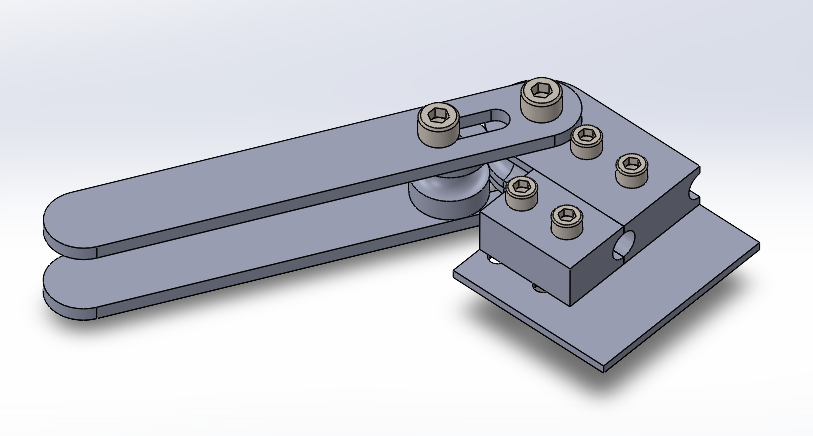
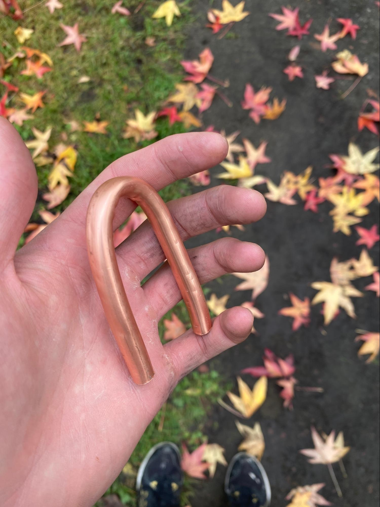

# Pipe Bending Jig

For this project I needed to create a jig which could create 180 degree bend in a very small pipe with a very small bending radius. I looked all around the market and couldn't find anything with a small enough diameter so I needed to make my own.

My first prototype was just a block of wood and 3d printed part and i realized the forces where much too high and everything needed to be much stronger

The second iteration uses a laser cut bend arm made from steel and 3d printed parts at 100% infill. I started by making the whole thing in CAD and then manufactured it using a bambulab x1 carbon and an Omax waterjet.

This was a much better improvement however the lack of support on the bending arm caused it to bend so I needed to beef it up and make the arm longer so I could get more leverage. I went back into CAD and fixed some things around for a v3. I make the whole thing over again and I landed on this as the final design, it ended up working much better than I thought for such a tight bend.

