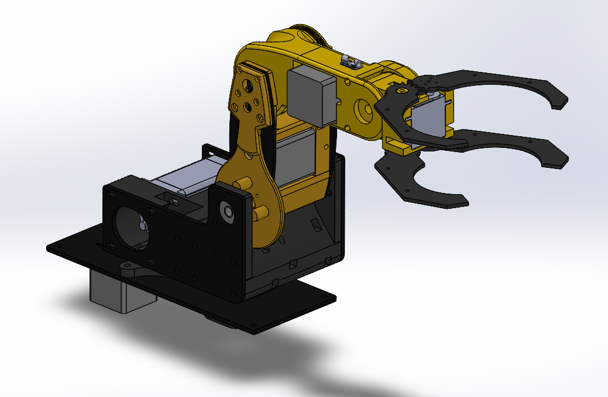
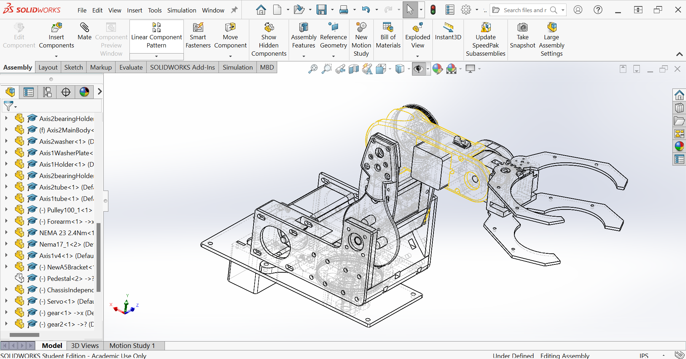
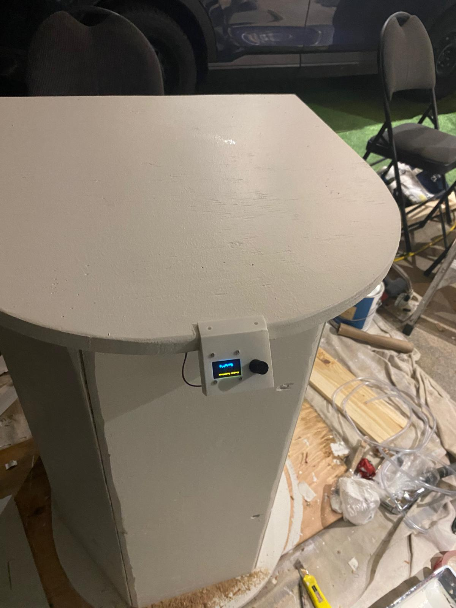

# Robotic Arm

This is a robotic arm that my brother and I made for an engineering project. The purpose of the device was to collect a cup and dispense a drink into it.

The entire thing was first modeled in solidworks and was made completely from scratch. The majority of the parts were made with 3d printing in mind but the design does utilize lightweight aluminum waterjet parts.

The electronics behind the project included a NEMA 23 motor for the shoulder joint and everything else was a NEMA 17 motor. The motors were driven using 4 dm542 drivers which could support microstepping, keeping the arm quiet and moving smoothly.

The whole thing was then printed and manufactured and then the wiring was routed through the axis of rotation to the electronics mounting underneath the arm.

The electronics were all made on a breadboard and the entire control system used an arduino uno.

Once the entire thing was put together we tested the stepper motors individually and performed weight tests to see how much the arm could hold.

<video width="640" height="360" controls preload="metadata">
  <source src="video1.mp4" type="video/mp4">
  Your browser does not support the video tag.
</video>

Video file info: video1.mp4

Then I made a pedestal for it to sit on top of and added a screen to display information.

Then pumps were added to the inside of the pedestal and were driven by an l298n motor drivers which were also powered by the arduino.

This is a video of the final product

<video width="640" height="360" controls preload="metadata">
  <source src="video2.mp4" type="video/mp4">
  Your browser does not support the video tag.
</video>

