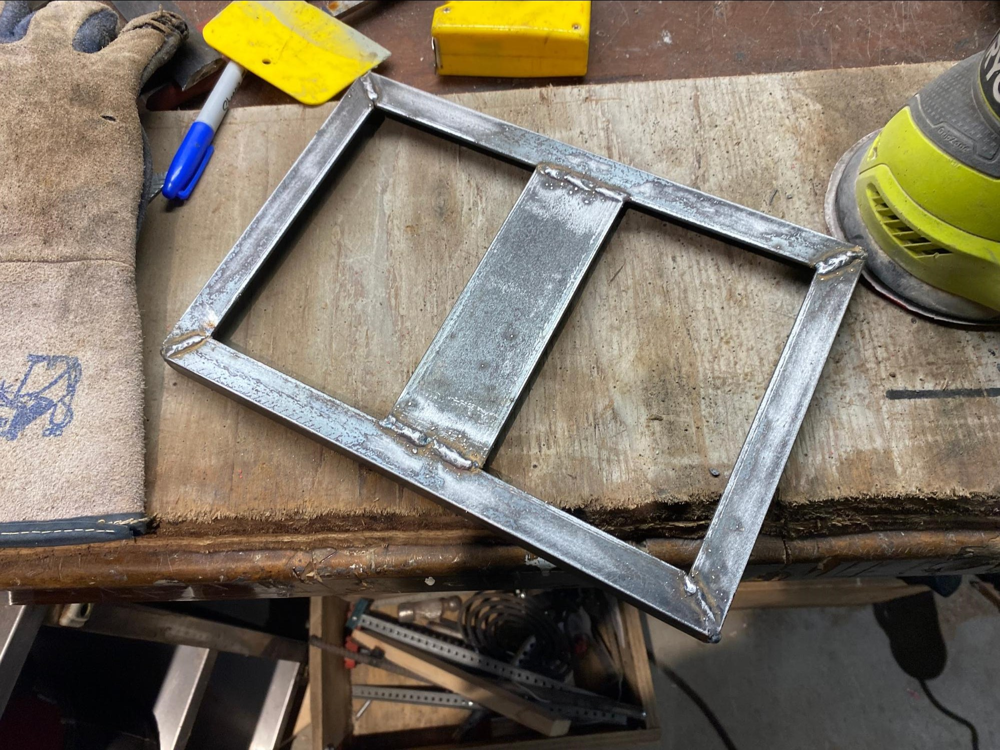
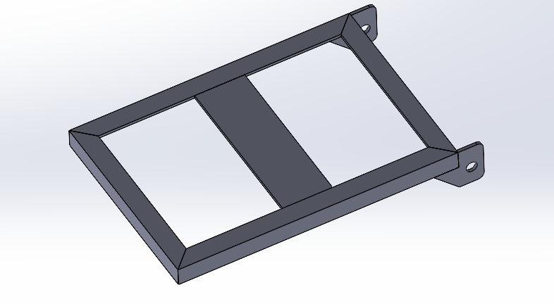

# My Web Application

This is just a simple lid that I made for my engineering design team. Its purpose is to seal around a battery casing and it will later be lined with carbon fibre.

I started by taking a bunch of measurements to get good dimensions for everything and then I made a quick cad model from which I could reference my cuts from.

I then bought all of the metal and used a corded grinder to create miters on all four corners. I used a magnet alignment tool to ensure everything was square before using my MIG welder to tack and weld everything into place.

